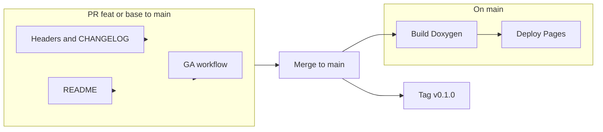

# v0.1.0 release and PR preparation

**Plan status:** completed (in-repo work). **Remaining manual step:** after merge to `main`, create Git tag `v0.1.0`, GitHub Release, and ensure Pages uses GitHub Actions (one-time settings if not already).

## Context

- **Done:** [`.github/workflows/docs.yml`](.github/workflows/docs.yml) builds the `docs` target and deploys to GitHub Pages on pushes to `main`. Root [`CMakeLists.txt`](CMakeLists.txt) uses `doxygen_add_docs` for [`src/`](src/) and [`daemon/`](daemon/), with `DOXYGEN_STRIP_FROM_PATH` set.
- **Done:** [`dev/legal_notice.txt`](dev/legal_notice.txt) and SPDX headers use **GPL-3.0-or-later**, aligned with [`LICENSE`](LICENSE).
- The **`/speckit-specify` skill** normally creates a **new** feature branch via `.specify/scripts/bash/create-new-feature.sh`. That flow is **not** appropriate for “ship current `feat/base-code`”—you stay on the existing branch; release work is CHANGELOG, tags after merge, CI, and headers.

## 1. License and copyright source of truth

- **SPDX short header** (your exact three-line block with `***` delimiters) on **all first-party, copyright-eligible source files** you intend to register—typically:
  - `src/**/*.cpp`, `src/**/*.h`, `daemon/**/*.cpp`, `daemon/**/*.h`, `tests/**/*.cpp`, root [`CMakeLists.txt`](CMakeLists.txt), [`src/CMakeLists.txt`](src/CMakeLists.txt), [`tests/CMakeLists.txt`](tests/CMakeLists.txt) if present, and any other hand-authored build/config in-repo that is *your* work.
- **Do not** add headers to **third-party or vendored trees** (e.g. `mtcreceiver/`, `cuemslogger/` submodules) or **generated** trees (`build/`, `build_*`). Match [.gitignore](.gitignore) and treat submodules as upstream.
- **Extended notice** (multiline, GPL-appropriate, modeled on today’s structure in `dev/legal_notice.txt` but with **GPL-3.0-or-later** wording and correct project name) for **“main, public, or first layer”** files. Define this set explicitly in one place (e.g. a short list in a commit message or internal checklist) to avoid debate—recommended minimum:
  - [`daemon/main.cpp`](daemon/main.cpp) (true entry point)
  - [`README.md`](README.md) (and optionally [`CLAUDE.md`](CLAUDE.md) if you want it in scope)
  - **Optional** root [`CMakeLists.txt`](CMakeLists.txt) if the authority treats it as a “first layer” deliverable; otherwise SPDX-only there is enough.
- **Action**: **Rewrite** [`dev/legal_notice.txt`](dev/legal_notice.txt) to be the canonical **GPL-3.0-or-later** extended text (not LGPL), aligned with [`LICENSE`](LICENSE) and the SPDX line you will use in short headers. Use it as the copy-paste source for extended blocks; keep author line consistent (today: Adrià Masip / StageLab Coop SCCL—your SPDX uses “Stagelab Coop SCCL”—pick **one** legal entity spelling and use it everywhere).

## 2. README updates for v0.1.0 and docs

- Add a **version line** (e.g. “Current release: v0.1.0”) and a **link to release notes** (see §4).
- After Pages exists, add **“API documentation (GitHub Pages)”** with the repo’s expected URL `https://<org-or-user>.github.io/<repo>/` (or custom domain if you add one later).
- Quick **sanity check**: overview still matches the shipped stack (lib + daemon, OSC, etc.)—[`README.md`](README.md) is already close; only light edits unless you want an explicit “Features in v0.1.0” bullet list pointing at CHANGELOG.

## 3. GitHub Actions: build docs + deploy to GitHub Pages

- **Trigger**: `push` to `main` (and optionally `workflow_dispatch` for manual rebuilds). Path filters are optional; including `src/**`, `daemon/**`, `CMakeLists.txt` avoids no-op full runs on unrelated docs-only edits if desired.
- **Job outline** (Ubuntu runner):
  - `submodules: false` and **`cmake -B build -DBUILD_DAEMON=OFF`** so the configure step does **not** require `mtcreceiver`/`cuemslogger` (see [`CMakeLists.txt`](CMakeLists.txt) `if(BUILD_DAEMON)` guards)—only what [`src/`](src/) needs: install **doxygen**, **cmake**, **g++**, **liblo** ([`pkg_check_modules(LIBLO ...)`](CMakeLists.txt)), **nlohmann JSON**, **pkg-config**, **tinyxml2** if still required at configure time (keep parity with a minimal local `cmake` that succeeds for `docs` only).
  - `cmake --build build --target docs`
  - Upload **`build/docs/html`** (or the actual Doxygen HTML root—verify with one local run) as the Pages artifact.
- **Permissions**: use the modern **Actions Pages** model: `permissions: pages: write`, `id-token: write`, `contents: read`; `actions/upload-pages-artifact` + `actions/deploy-pages` (or the current recommended pattern from GitHub docs at implementation time).
- **Repo settings** (manual, one-time): enable **GitHub Pages** from **GitHub Actions** (not branch-based `gh-pages` unless you prefer that; Actions artifact is standard now).
## 3a. Doxygen: include `daemon` (recommended implementation)

**Best approach:** keep a **single** `doxygen_add_docs(docs ...)` target and pass **two input roots**—no separate Doxyfile, no second doc target, no change to the GitHub Actions flow beyond what already runs `cmake --build … --target docs`.

In root [`CMakeLists.txt`](CMakeLists.txt), extend the call from one directory to two (order does not matter for HTML output):

```cmake
doxygen_add_docs(docs
    "${CMAKE_SOURCE_DIR}/src"
    "${CMAKE_SOURCE_DIR}/daemon"
    COMMENT "Generating API documentation with Doxygen (lib + daemon)"
)
```

`DOXYGEN_RECURSIVE` is already `YES`, so all headers and sources under `daemon/` (e.g. `comms/`, `config/`, `main.cpp`, application classes) are scanned. Doxygen only **reads** these paths; it does **not** compile or link the daemon, so this remains compatible with **CI** that uses `-DBUILD_DAEMON=OFF` (no submodules, no RtMidi/NNG for the build graph).

**Optional polish (same change set or follow-up):** set `DOXYGEN_STRIP_FROM_PATH` to `${CMAKE_SOURCE_DIR}` so generated HTML “File” listings show paths relative to the repo root instead of long absolute paths.

**Risk:** `DOXYGEN_WARN_AS_ERROR` is `YES`. Adding `daemon/` may surface new Doxygen warnings (e.g. missing `@file`/`@brief` on a symbol). Fix docstrings or tight `EXCLUDE` patterns only if something is legitimately not part of the public story; the constitution already expects Doxygen-style comments on public surfaces.

## 4. Release notes (v0.1.0)

- Add **`CHANGELOG.md`** (or `docs/RELEASE_NOTES.md`) with a **v0.1.0** section dated at merge/release.
- **Content source**: map deliverables to the feature specs already in-repo ([`specs/001-phase0-scaffold/`](specs/001-phase0-scaffold/) through [`specs/006-fade-registry-tick-loop/`](specs/006-fade-registry-tick-loop/)) in user-facing language, e.g.:
  - Phase 0: project scaffold, daemon skeleton, config/CLI
  - Gradient curves and evaluation pipeline
  - MTC/timecode tick source and adapter (mtcreceiver v2)
  - NNG bus client for comms
  - Fade registry, tick loop, OSC-oriented motion/fade path
- Keep it **outcome-oriented** (what operators/integrators get), not file-level implementation detail.

## 5. Git tag and GitHub Release (post-merge)

- After **`feat/base-code` is merged to `main`**, tag **`v0.1.0`** on `main` and create a **GitHub Release** with the same text as `CHANGELOG` for v0.1.0 (can be copy-paste). This is **not** a prerequisite for the PR diff but should be in the runbook for “production” release.

## 6. speckit-specify alignment

- **Do not** run `create-new-feature.sh` for this work—it would create a new numbered branch and spec; you are **releasing** existing work.
- If you need a **formal spec artifact** for process compliance, a small addendum (e.g. `specs/000-v0-1-0-release/spec.md`) is optional; the **user-facing** deliverables above satisfy the v0.1.0 request more directly.

## Risk / checklist

| Item | Note |
|------|------|
| LGPL vs GPL in `legal_notice` | Must be fixed before extended blocks reference it |
| Doxygen input scope | Add `daemon/` via second arg to `doxygen_add_docs` (§3a) |
| CI package list | Must match a minimal `cmake` that builds `docs` with `BUILD_DAEMON=OFF` |
| Copyright entity spelling | Stagelab vs StageLab—one canonical string |


