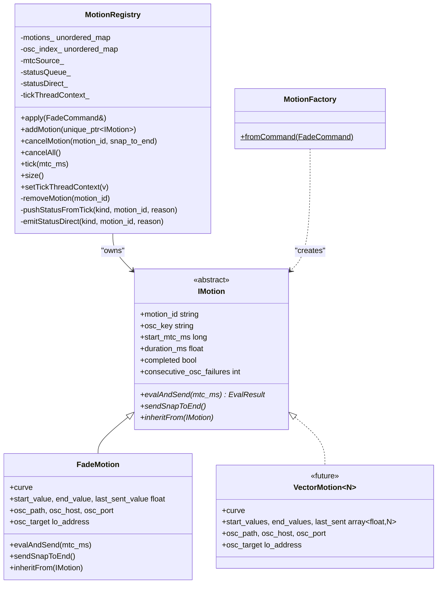

# MotionRegistry Refactor (Layout 2, Option C)

Replace the monolithic `gme::engine::FadeRegistry` with a cleanly factored hierarchy under `gme::motion`. The registry owns motion *lifecycle* uniformly; each concrete motion type owns its own *payload shape* and *send logic* behind the `IMotion` interface.

This plan implements **only** the scalar-fade case today (`FadeMotion`), with explicit seams (`IMotion` pure-virtual contract + `MotionFactory` dispatcher skeleton) for future `VectorMotion<N>` and crossfade types to attach without further registry changes.

## Architecture



**Key architectural rules** (each one is testable):

1. `MotionRegistry` is **concrete and not designed for subclassing**. Its data members are `private`; new motion kinds extend `IMotion`, not the registry.
2. `IMotion` exposes **common lifecycle state as public fields** (`motion_id`, `osc_key`, `start_mtc_ms`, `duration_ms`, `completed`, `consecutive_osc_failures`) and **per-type behaviour as pure-virtual methods** (`evalAndSend`, `sendSnapToEnd`, `inheritFrom`). Per-type data (curve, payload, transport handles) lives in the derived type only.
3. Supersede is keyed by a **single composite** `"host:port:path"` string, stored in `IMotion::osc_key`. Multi-path outputs are multiple motions. Multi-dimensional payloads are a single motion whose `evalAndSend` emits one OSC message with N arguments.
4. `GradientEngine` holds **exactly one** `MotionRegistry`. Command dispatch routes through `MotionFactory::fromCommand`, not through per-kind registries.
5. Virtual dispatch cost is bounded: one virtual call per active motion per tick (constitution Principle IV + Virtual Dispatch standard).
6. **`motion_id` uniqueness is a hard contract** enforced by the registry. `addMotion` on a collision emits `MotionError:"duplicate_motion_id"` for the incoming id, drops the new motion, and leaves the existing motion untouched — regardless of whether the `osc_key` matches. "Retarget" is not supported via reused id; it requires `cancel_motion` + `start_motion`.

## Files to Create

### [`src/motion/IMotion.h`](src/motion/IMotion.h)

Abstract base. Shared fields public (`motion_id`, `osc_key`, `start_mtc_ms`, `duration_ms`, `completed`, `consecutive_osc_failures`). Virtual destructor + three pure-virtual methods:

- `EvalResult evalAndSend(long mtc_ms) = 0;` — compute value, send via transport, return completion/failure. Called once per motion per tick from `MotionRegistry::tick`.
- `void sendSnapToEnd() = 0;` — one final transport message at the "end" state. Called only by `cancelMotion(snap_to_end=true)`.
- `void inheritFrom(const IMotion& prior) = 0;` — adopt state from a motion being superseded on the same `osc_key`. `FadeMotion` copies `prior.last_sent_value` into `this->start_value` and `this->last_sent_value`. Default override in derived types is allowed to be a no-op if the motion kind has no inheritable state.

### [`src/motion/EvalResult.h`](src/motion/EvalResult.h)

```cpp
struct EvalResult {
    bool        completed = false;        // t reached 1.0 this tick
    bool        failed    = false;        // evalAndSend detected terminal failure
    const char* failure_reason = nullptr; // e.g. "osc_send_failed"; nullptr unless failed
};
```

Registry uses `completed` / `failed` to schedule removal + status emission. Reason strings are static-storage `const char*` (no heap allocation in hot path).

### [`src/motion/MotionRegistry.h` / `.cpp`](src/motion/MotionRegistry.h)

Concrete registry. Ports the following from the old `FadeRegistry`:

- Constructor signature (same `mtcSource`, `statusQueue`, `statusDirect`, optional `oscSend`). `oscSend` is kept on the registry for test injection; it is **handed to each motion at construction time by `MotionFactory`**, not called directly by the registry. The registry never touches transport.
- `apply(FadeCommand&)` — routes `START_FADE` → `MotionFactory::fromCommand(cmd)` → `addMotion(std::move(ptr))`; `CANCEL_MOTION` → `cancelMotion`; `CANCEL_ALL` → `cancelAll`; logs and drops `START_CROSSFADE` (Phase 4 unchanged).
- `addMotion(std::unique_ptr<IMotion>)` — ordered checks:
  1. **Duplicate-`motion_id` guard**: if `motions_` already contains `m->motion_id`, emit `MotionError:"duplicate_motion_id"` for the incoming id, drop the incoming motion (destructor frees lo_address + curve), return. The existing motion is untouched.
  2. **`osc_key` supersede**: look up `m->osc_key` in `osc_index_`; on hit, emit `MotionError:"superseded"` for the old motion, call `new_motion->inheritFrom(old_motion)`, erase the old, fall through.
  3. Insert into both `motions_` and `osc_index_`.
- `cancelMotion(const std::string& motion_id, bool snap_to_end)` — was `cancelFade`. Calls `m->sendSnapToEnd()` if requested, then `removeMotion`.
- `cancelAll()` — clears both maps; motions free their own transport handles via destructor.
- `tick(long mtc_ms)` — iterate `motions_`, call `m->evalAndSend(mtc_ms)`, handle completion / failure-threshold / removal uniformly.
- `removeMotion`, `pushStatusFromTick`, `emitStatusDirect`, `setTickThreadContext`, `size`.

All data members `private`. No `protected`.

### [`src/motion/FadeMotion.h` / `.cpp`](src/motion/FadeMotion.h)

`FadeMotion : IMotion`. Owns `curve`, `start_value`, `end_value`, `last_sent_value`, `osc_path`, `osc_host`, `osc_port`, `osc_target` (lo_address). Destructor frees `osc_target`.

- `evalAndSend(mtc_ms)` — computes `t`, evaluates curve, computes scalar `value`, calls the injected `OscSendFn`, updates `last_sent_value`, increments / resets `consecutive_osc_failures`, returns `EvalResult`.
- `sendSnapToEnd()` — one `oscSend_(osc_target, osc_path, end_value)` call.
- `inheritFrom(const IMotion& prior)` — `dynamic_cast` to `FadeMotion*`; on match, copy `prior.last_sent_value` into `this->start_value` and `this->last_sent_value`. On mismatch, no-op (e.g. a future `VectorMotion<3>` superseding a `FadeMotion` — different payload shape means we cannot inherit).

### [`src/motion/MotionFactory.h` / `.cpp`](src/motion/MotionFactory.h)

Free function `fromCommand(const FadeCommand& cmd, ctx) → std::unique_ptr<IMotion>`, where `ctx` carries `mtcSource`, `oscSend`, and the status-emission callbacks the motion needs at construction (for `unknown_curve_type` / `osc_address_failed` errors that must be emitted by the factory, not the registry — these failures happen *before* the motion exists).

Phase 4 switch:

```cpp
switch (cmd.type) {
  case START_FADE:
    return makeFadeMotion(cmd, ctx);  // today
  case START_CROSSFADE:
    // TODO Phase 7: return makeCrossfadePair(cmd, ctx);
    return nullptr;
  // case START_VECTOR_MOTION:
  //   TODO future: return makeVectorMotion<N>(cmd, ctx);
}
return nullptr;
```

The factory is where `CurveFactory::createCurve` is called and where `lo_address_new` happens. Keeping these out of the registry means `MotionRegistry::addMotion` only sees fully-constructed motions and cannot fail in construction-specific ways.

## Files to Delete

- `src/engine/FadeRegistry.h`
- `src/engine/FadeRegistry.cpp`
- `src/engine/ActiveFade.h`
- `src/motion/motion.cpp` (placeholder, replaced by the new files)

## Files to Modify

### [`src/engine/GradientEngine.h` / `.cpp`](src/engine/GradientEngine.h)

Replace the `FadeRegistry` member with `MotionRegistry`. The public API of `GradientEngine` does not change; only the internal type does. Command drain in `onTick` is unchanged — it still calls `registry.apply(cmd)`, which internally routes to the factory.

### [`src/CMakeLists.txt`](src/CMakeLists.txt)

```cmake
set(GME_SOURCES
    time/time.cpp
    time/MtcTickSource.cpp
    gradient/SigmoidCurve.cpp
    gradient/BezierCurve.cpp
    gradient/ResampledCurve.cpp
    gradient/CurveFactory.cpp
    signal/signal.cpp
    signal/FadeCommand.cpp
    osc/OscSender.cpp
    motion/MotionRegistry.cpp
    motion/FadeMotion.cpp
    motion/MotionFactory.cpp
)
```

(Removes `engine/FadeRegistry.cpp` and `motion/motion.cpp`.)

### [`src/signal/FadeCommand.h`](src/signal/FadeCommand.h) — minimal touch

- Rename `FadeCommand::Type::CANCEL_FADE` → `CANCEL_MOTION`.
- Keep other fields / command types as-is for Phase 4 (scope reasons).
- Update the class docstring to note that `fade_id` is the wire-key for the `motion_id` at the `MotionRegistry` boundary. The struct name stays `FadeCommand` for one more cycle; a follow-up plan can rename to `MotionCommand` if desired.

### [`src/signal/FadeCommand.cpp`](src/signal/FadeCommand.cpp)

Update the wire-command parser to accept `"cancel_motion"` (and drop the old `"cancel_fade"` per the user's "wire protocol open" decision). Map `data.motion_id` → `FadeCommand.fade_id`.

### [`src/signal/StatusEmitRequest.h`](src/signal/StatusEmitRequest.h)

Rename `StatusKind` enumerators for coherency with the Motion-oriented refactor:

- `StatusKind::FadeComplete` → `StatusKind::MotionComplete`
- `StatusKind::FadeError`    → `StatusKind::MotionError`

Add a new standard reason string to the enum docstring: `"duplicate_motion_id"` (alongside the existing `"osc_send_failed"`, `"osc_address_failed"`, `"unknown_curve_type"`, `"superseded"`, `"parse_error"`).

The `StatusEmitRequest::fade_id` field name stays as-is (wire-level rename to `motion_id` is out of scope; a wire-v2 follow-up plan handles it).

### NNG wire serialisation (in `NngBusClient`)

- `data.event: "fade_complete"` → `"motion_complete"`.
- `data.event: "fade_error"` → `"motion_error"`.
- Controller-side parsers must update to match. Wire protocol is open per the working decision for this branch.

### Tests

- **Rename** `tests/test_fade_registry.cpp` → `tests/test_fade_motion.cpp`. All 20 existing tests stay and must pass unchanged (behavioural contract preserved).
- **New** `tests/test_motion_registry.cpp` — lifecycle-only tests via a `TestMotion : IMotion` double that scripts `EvalResult` outcomes. Covers everything the registry does *independent* of fade-specific logic: supersede inheritFrom dispatch, failure-threshold removal, completion removal, cancel semantics, status routing.
- **Rename** `tests/test_fade_registry_bench.cpp` → `tests/test_motion_registry_bench.cpp`. Target unchanged (SC-007: p99 ≤ 2 ms at 50 fades @ 200 Hz).

### Spec contracts

- **Strip + rename** [`specs/006-fade-registry-tick-loop/contracts/fade-registry-api.md`](specs/006-fade-registry-tick-loop/contracts/fade-registry-api.md) → `fade-motion-api.md`. Keep only scalar-fade-specific contract: curve + scalar lerp + single-float OSC send, `inheritFrom` semantics, `sendSnapToEnd` semantics.
- **Create** `specs/006-fade-registry-tick-loop/contracts/motion-registry-api.md` — documents the registry + `IMotion` contract, threading model, status-routing rules, supersede rule, failure threshold, constants table. Includes a "Future extension — `VectorMotion<N>`" section describing the `std::array<float, N>` payload model, the N-argument OSC message shape, and how supersede keeps its single-key invariant.

## Key Rename Map

| Old | New |
|-----|-----|
| `gme::engine::FadeRegistry` | `gme::motion::MotionRegistry` |
| `gme::engine::ActiveFade` (struct) | `gme::motion::FadeMotion : IMotion` |
| `src/engine/FadeRegistry.{h,cpp}` | `src/motion/MotionRegistry.{h,cpp}` |
| `src/engine/ActiveFade.h` | `src/motion/FadeMotion.h` + `src/motion/IMotion.h` |
| `ActiveFade::fade_id` | `IMotion::motion_id` |
| `FadeRegistry::fades_` | `MotionRegistry::motions_` |
| `FadeRegistry::removeFade` | `MotionRegistry::removeMotion` |
| `FadeRegistry::cancelFade` | `MotionRegistry::cancelMotion` |
| `FadeCommand::Type::CANCEL_FADE` | `FadeCommand::Type::CANCEL_MOTION` |
| wire `"cancel_fade"` | wire `"cancel_motion"` |
| `StatusKind::FadeComplete` | `StatusKind::MotionComplete` |
| `StatusKind::FadeError` | `StatusKind::MotionError` |
| wire event `"fade_complete"` | `"motion_complete"` |
| wire event `"fade_error"` | `"motion_error"` |
| `FadeRegistry::OscSendFn` | `gme::motion::OscSendFn` (shared alias in `MotionRegistry.h`) |

> `FadeCommand::fade_id` is a **protocol field**; the alias to `IMotion::motion_id` happens inside `MotionFactory::fromCommand` and `MotionRegistry::cancelMotion`. A later wire-v2 migration may rename it to `motion_id` on the wire too; that is out of scope here.

## Testing Strategy

### 1. `test_motion_registry.cpp` — base lifecycle in isolation

A `TestMotion : IMotion` helper scripts the outcome of each `evalAndSend` call (sequence of `EvalResult { completed, failed, failure_reason }`). Each test exercises the registry without the cost / complexity of curve evaluation or real OSC.

Required test cases (new, fade-agnostic):
- `addMotion` inserts into both `motions_` and `osc_index_`.
- `addMotion` on a duplicate `osc_key` (different `motion_id`) emits `MotionError:"superseded"` for the old id, calls `inheritFrom` on the new motion exactly once with the old motion as argument, then erases the old.
- `addMotion_duplicate_id_rejects`: insert id `"m1"` on path `/a`, then insert `"m1"` on path `/b`. Expect one motion in registry (`/a` unchanged), one `MotionError:"duplicate_motion_id"` for the incoming id, no leak (verified via a transport-send counter on the test double, which should never have been wired to the incoming motion).
- `addMotion_duplicate_id_same_path_rejects`: insert `"m1"` on `/a`, then insert `"m1"` on `/a` again. Expect `MotionError:"duplicate_motion_id"` (NOT `superseded`). The duplicate-id check runs before the supersede check.
- `cancelMotion(snap_to_end=true)` invokes the motion's `sendSnapToEnd()` exactly once before removal.
- `cancelMotion(snap_to_end=false)` does not invoke `sendSnapToEnd()`.
- `cancelAll()` removes all entries in ≤ 5 ms (SC-004) and never calls `sendSnapToEnd`.
- `tick()` removes motions whose `evalAndSend` returned `completed=true` and emits `MotionComplete`.
- `tick()` increments `consecutive_osc_failures` when `evalAndSend` returns `failed=true`; removes + emits `MotionError` once the counter reaches `kOscFailureThreshold`.
- `tick()` resets `consecutive_osc_failures` to 0 when `evalAndSend` returns `failed=false` after prior failures.
- Status queue overflow: 70 completions with a 64-slot queue yields ≤ 64 drained statuses with no tick-thread block.
- Drain-thread-context supersede emits via `statusDirect_`; tick-thread-context supersede emits via `statusQueue_`.

### 2. `test_fade_motion.cpp` — behavioural regression

All 20 existing [test_fade_registry.cpp](tests/test_fade_registry.cpp) tests (`us1_*`, `us2_*`, `us3_*`, `us4_*`, `us5_*`) are ported verbatim and must pass with **no changes to their assertions** beyond:

- Type swap: `FadeRegistry` → `MotionRegistry`.
- Construction path: `makeReg()` now builds a `MotionRegistry` and a `MotionFactory`.
- Access: tests that previously reached into `ActiveFade` fields now go through `FadeMotion*` retrieved via a test accessor (or via behaviour-level assertions only).

The `us2_supersede` test is the canonical `inheritFrom` regression check.

### 3. LSP contract test

Inside `test_motion_registry.cpp`, one test constructs a `FadeMotion` directly, hands it to the registry via `addMotion`, and exercises `cancelMotion` / `tick` / `size` through the registry. Proves the scalar concrete type satisfies the abstract contract end-to-end.

### 4. Benchmark (`test_motion_registry_bench.cpp`)

- Keep the existing 50-fade / 200-Hz / 400-tick scenario. Must stay within SC-007 p99 ≤ 2 ms.
- Add a second scenario: 50 `TestMotion` with no-op `evalAndSend` — isolates registry overhead from `FadeMotion` work. The delta versus the current `FadeRegistry` bench is the virtual-dispatch cost; document it in the final tick budget.

## Migration Order (one atomic commit per numbered step)

1. Add `IMotion.h`, `EvalResult.h`, `MotionRegistry.{h,cpp}`, `FadeMotion.{h,cpp}`, `MotionFactory.{h,cpp}`, new CMake entries. Keep the old `FadeRegistry` in place — new code compiles alongside.
2. Switch `GradientEngine` to `MotionRegistry`. All behavioural tests now cover both paths (the old tests still target `FadeRegistry`, the new `test_motion_registry.cpp` targets the new stack).
3. Port `test_fade_registry.cpp` → `test_fade_motion.cpp` under the new stack. Confirm all 20 regressions pass.
4. Delete `src/engine/FadeRegistry.*`, `src/engine/ActiveFade.h`, `src/motion/motion.cpp`. Drop the old CMake entries. Delete the old bench after the new bench passes SC-007.
5. Update NNG parser to `"cancel_motion"`. Bump the wire-protocol version note in the NNG contract file.
6. Update spec contracts (`fade-registry-api.md` → `fade-motion-api.md`, new `motion-registry-api.md`).

## Constitution Compliance Self-Check

| Principle | Compliance |
|-----------|------------|
| I. Deterministic Evaluation | `IMotion::evalAndSend` is a pure function of `mtc_ms` and motion state. No registry-internal time source reads during eval. |
| II. Modular Architecture | Motion code moves from `gme::engine` → `gme::motion`, matching the module map. `gme::engine` retains only orchestration. |
| III. Library-First | All new code in `libgradient_motion`. Daemon untouched. |
| IV. Real-Time Safety | One virtual call per motion per tick; no heap allocation in `evalAndSend`; failure-reason strings are static `const char*`. |
| V. Protocol-Agnostic Core | `MotionRegistry` has zero transport knowledge. Only `FadeMotion` (a concrete `IMotion`) touches liblo. A future `DmxMotion` can drop in without registry changes. |
| VI. Documentation Standards | Every public method in the new headers gets the full docstring template. Regenerate Doxygen at PR time. |
| VII. Extensibility via Abstraction | Future `VectorMotion<N>`, `CrossfadeMotion`, etc. all attach at `IMotion`. No registry or dispatcher change needed. |

## Out of Scope (explicit)

- `VectorMotion<N>` implementation — only the seam (`IMotion` interface + `MotionFactory` hook) is created.
- Crossfade semantics — `START_CROSSFADE` still logs-and-drops exactly as today.
- Renaming `FadeCommand` struct or `fade_id` wire field — deferred to a wire-protocol-v2 plan.
- Renaming `StatusEmitRequest::fade_id` field — deferred to the same wire-v2 plan. (The `StatusKind` enumerators ARE renamed here for coherency; only the `fade_id` field name is deferred.)
- Moving `gme::signal::StatusKind` / `StatusEmitRequest` into `gme::motion` — they remain transport-agnostic signal types.
- Adding a dedicated `retarget_motion` wire command — not a supported operation; use `cancel_motion` + `start_motion`.
